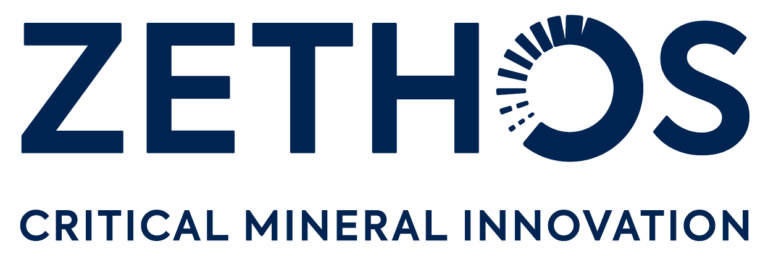

<!--permalink: /about/-->
### About us
We are a group of scientists and engineers applying electrochemistry to energy storage, clean fuel production, and sustainable materials processing.

### Research

#### Electrocatalyst Development and Characterisation

Our group develops electrocatalytic materials for redox batteries, fuel cells, and carbon dioxide reduction. This includes the synthesis of atomically precise metallic clusters (in collaboration with Vladimir Golovko, Dept. Chemistry) and the preparation of dimensionally stabilised anodes via spray pyrolysis.

We characterise these materials using electrochemical techniques including cyclic voltammetry, electrochemical impedance spectroscopy (EIS), and steady-state polarisation curves. Structural analysis is carried out by X-ray diffraction (XRD), X-ray photoelectron spectroscopy (XPS), electron microscopy, gas adsorption, and X-ray absorption spectroscopy (XAS).

<figure style="text-align: center;">
  
  <figcaption>High surface area cobalt oxide electrocatalytic film used for alkaline water electrodes</figcaption>
</figure>

---

#### Electrochemical Carbon Dioxide Reduction

Electrochemical conversion of CO₂ into useful fuels and chemicals — such as methane, methanol, and formic acid — is an increasingly promising route to closing the carbon cycle. We have studied mass transport effects on this reaction and developed methods to tune its selectivity. Current work focuses on gold-based electrocatalysts for CO₂-to-syngas conversion (CO + H₂), supported by an in-house electrochemical flow cell.

<figure style="text-align: center;">
  
</figure>

---

#### Water Electrolysis

Water electrolysis splits water into hydrogen and oxygen using electricity. When powered by renewables, this produces "green" hydrogen with no direct carbon emissions. We develop new electrocatalysts and engineer catalytic layers and membrane electrode assemblies to improve performance, reduce cost, and increase the durability of water electrolysers. This includes a recently funded project on anion exchange membrane (AEM) water electrolysis.

<figure style="text-align: center;">
  
</figure>

---

#### Enhancing the Kinetics of Redox Flow Batteries

Carbon felt is the standard electrode material in redox flow batteries (RFBs), but it can exhibit poor electrochemical activity towards RFB redox couples and lose energy through unwanted gas evolution. We are developing superior electrodes by tailoring the surface chemistry of carbon felt to enhance RFB reaction rates while suppressing side reactions. To isolate and study the underlying redox kinetics, we use single carbon fibre electrodes — avoiding the complexity of mass transfer effects — and fit experimental data to models incorporating intrinsic kinetics and diffusive transport.

<figure style="text-align: center;">
  
</figure>

---

#### Metal Production and Recovery from Ore and Waste Materials

Metal production is the largest single industrial source of man-made greenhouse gas emissions. Replacing fossil-fuel-derived carbon with renewably generated electricity — through ultra-high-temperature molten oxide electrolysis — offers a path to near-zero-emission metal production. Our research program identifies and tests molten metal oxide systems to determine whether electrochemical reduction is viable, with current work targeting several metals at temperatures up to 1600 °C.

Alongside this academic programme, Prof. Marshall co-founded [Zethos](https://zethos.tech) (formerly Zincovery), a company commercialising a waste treatment and critical mineral recovery technology developed in our laboratory. Zethos uses selective reduction and electrochemical refining to extract critical minerals — including zinc, copper, nickel, and manganese — from ores and industrial waste streams.

<figure style="text-align: center;">
  
</figure>
